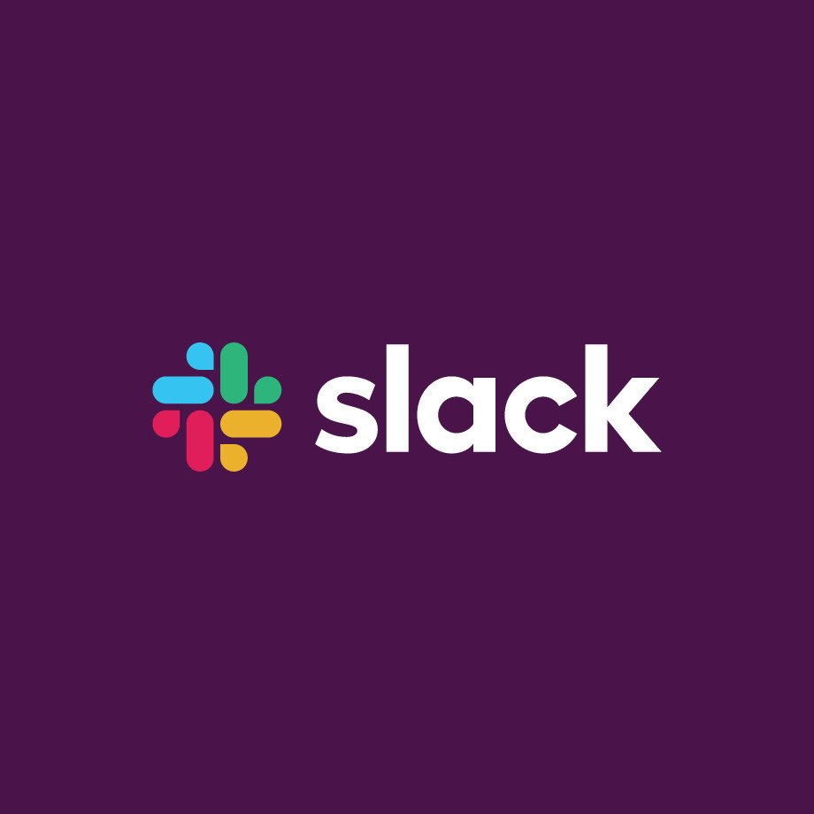

Teams throughout the world are adapting to a new normal: working remotely. And with colleagues distributed far and wide, teamwork is more important than ever. That’s why we’ve made some changes to our [Slack for Nonprofits program.](https://slack.com/intl/en-vn/help/articles/360045240813-Slack-for-Nonprofits-during-COVID-19)

Now nonprofit organizations of any size are eligible to receive three months of our Standard or Plus plan for their workspace, completely free of charge. With a more powerful, secure version of [Slack](https://slack.com/intl/en-in/pricing/paid-vs-free), you can connect your teams and improve everyone’s productivity.
